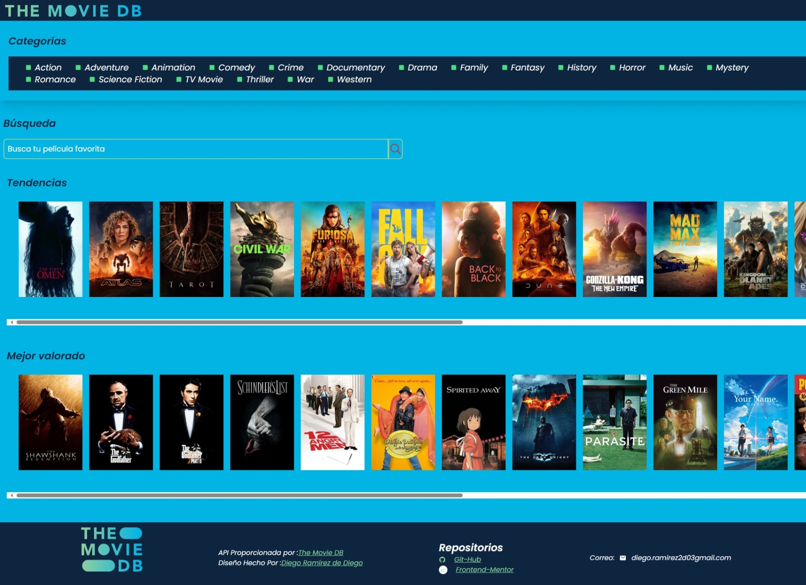

# Api Movie

[Sitio Web]()

## ¡BIENVENIDO! 👋

Gracias por tomarte el tiempo para ver este repositorio.
En este sitio web se muestran películas en diferentes secciones:

-Categorías.
-Tendencias.
-Mejor valorado.
-Detalles sobre la pelicula.

Además de que, puedes buacar tus películas favoritas.

### **HERRAMIENTAS QUE SE UTILIZO**
-React Js + Vite
-Tailwind CSS

**npm**
```
-React-Router-Dom
 npm install react-router-dom@6

-React-Lazy-Load-Image-Component
 npm i react-lazy-load-image-component

```




## API

Esta api Fue proporcionada por [TMDB](https://developer.themoviedb.org/reference/intro/authentication)